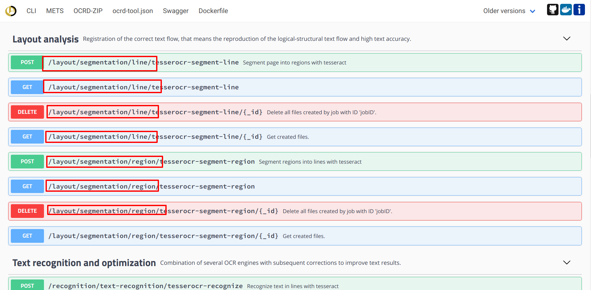

layout: true
  
<div class="my-header"></div>

<div class="my-footer">
  <table>
    <tr>
      <td>VC 2018-04-20</td>
      <td style="text-align:right"><a href="https://ocr-d.github.io">Packaging tools for OCR-D</a></td>
    </tr>
  </table>
</div>

---

class: title-slide

# Tool descriptions for OCR-D

| Konstantin Baierer |
|:-------------------:|
| [konstantin.baierer@gmail.com](mailto:konstantin.baierer@gmail.com) |

---

# Uniform descriptive interface

- Documentation
  - Contact information
  - URL of Git repo, downloads, issue tracker, docker image …
  - Textual description
- Discovery
  - Step within functional model
  - Categories
  - Tags
- Automation / introspection
  - Validate parameters
  - Generate Swagger definitions
  - Wrap CLI in Web services
  - …

---

class: small-pre

# How?

- JSON document `ocrd-tool.json` in project root directory
- Defined by [`ocrd-tool JSON Schema`](https://github.com/OCR-D/spec/blob/master/ocrd_tool.schema.yml)

```yaml
type: 'object'
description: 'Schema for tools by OCR-D MP'
required: ['git_url', 'tools']
properties:
  git_url:
    description: 'Github/Gitlab URL'
    type: 'string'
    format: 'url'
  dockerhub:
    description: 'DockerHub image'
    type: 'string'
  tools:
    type: 'array'
    items:
      type: 'object'
      required: ['description', 'step', 'binary']
      properties:
        binary:
          description: 'The name of the CLI in $PATH'
          type: string
        parameterSchema:
          description: 'JSON Schema for the parameters.json file'
          type: object
        description:
          description: 'Concise description what the tool does'
      [...]
```

---

class: split-40

# GitHub

.left-column[

]
.right-column[

]

---

class: split-40

# Issue Tracker

.left-column[

]
.right-column[

]

---

class: split-40

# Docker Hub

.left-column[

]
.right-column[

]

---

class: split-40

# Tool: tag

.left-column[

]
.right-column[

]

---

class: split-40

# Tool: step

.left-column[

]
.right-column[

]

---

class: split-40

# Tool: executable

.left-column[

]
.right-column[

```sh
$> ocrd-tesserocr-recognize \
  --mets https://.../mets.xml \
  --working-dir /tmp/working-dir-123 \
  --input-file-grp OCR-D-IMG \
  --output-file-grp OCR-D-OCR-TESS \
  --group-id PAGE-0001
```
]

---

class: split-40

# Tool: executable + docker

.left-column[

]
.right-column[

```sh
$> docker run --rm -it ocrd/tesserocr \
  ocrd-tesserocr-recognize \
    --mets https://.../mets.xml \
    --working-dir /tmp/working-dir-123 \
    --input-file-grp OCR-D-IMG \
    --output-file-grp OCR-D-OCR-TESS \
    --group-id PAGE-0001
```
]

---

class: split-40

# Tool: executable + parameters

.left-column[

]
.right-column[

```sh
$> curl file:///tmp/param.json
{"random-param": 42}
$> ocrd-kraken-binarize -p file:///tmp/param.json
× Unknown param 'random-param'
```

```sh
$> curl file:///tmp/param.json
{"structure-level": 'word'}
$> ocrd-kraken-binarize \
  -p file:///tmp/param.json
× Invalid 'structure-level': 'word'
```

```sh
$> curl file:///tmp/param.json
{"structure-level": 'page'}
$> ocrd-kraken-binarize \
  -p file:///tmp/param.json
✓ OK
```
]

---

# Open questions

- JSON vs. DITA
- How tightly should CLI and ocrd-tool.json be coupled?
- Registry mechanism

---

# Inspiration

- [OCR-D/ocrd_tesserocr](https://github.com/OCR-D/ocrd_tesserocr) - Granular access to tesseract via tesserocr python bindings
- [OCR-D/ocrd_kraken](https://github.com/OCR-D/ocrd_kraken) - Wrap kraken with OCR-D spec-compliant CLI
- [OCR-D/pyocrd](https://github.com/OCR-D/pyocrd) - Python library with decorators, helper methods and base classes for simplifying spec compliant tools. Contains `ocrd` meta-CLI for validation of `ocrd-tool.json`, batch processing, generating Swagger, running web services etc.
- [Specs](https://ocr-d.github.io)
